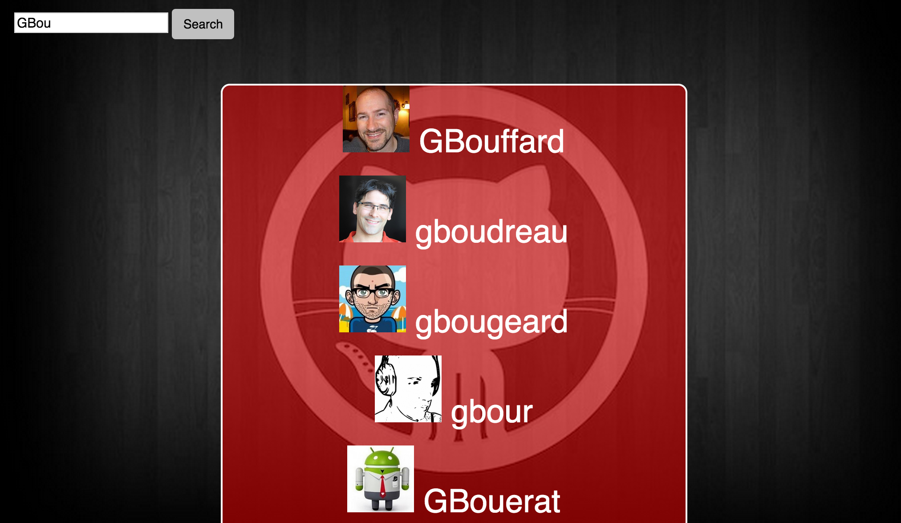
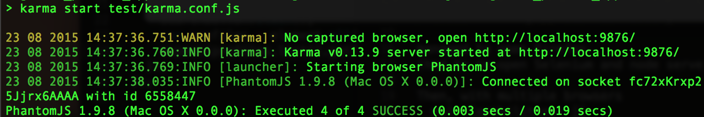
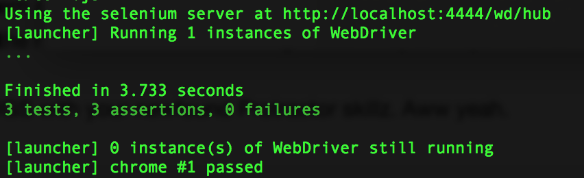

:octocat: Github profile app :octocat:
=================

This the tutorial from week 7 at Makers Academy. The project was to create a simple Github Profile app purely in JavaScript that grabs data from the Github API in order to display a specified users avatar, number of followers and number of repos.

The project involved using JavaScript to consume data available from third parties over the network (e.g. Github API data accessed via Ajax) and using more advanced JavaScript Model View Controller (MVC) frameworks such as AngularJS.

Heroku
----
[link to come soon]()



Objectives of exercise
----
To learn about API calls, AngularJS, NodeJS and Karma and Protractor Testing.

Technologies used
----
- Javascript
- AngularJS
- Node Server
- Npm & Bower
- Github API
- Karma and Protractor
- Selenium Server & WebDriver
- grunt & jshint
- jQuery

How to run it
----
```
git clone git@github.com:GBouffard/github_profile_app.git
cd github_profile_app
npm start
```
By opening your browser on http://localhost:3000/, you can now search for profiles on Github with this users search application.

How to run tests
----
```
cd github_profile_app
npm test
protractor test/e2e/conf.js
```

and this is what you should see:



